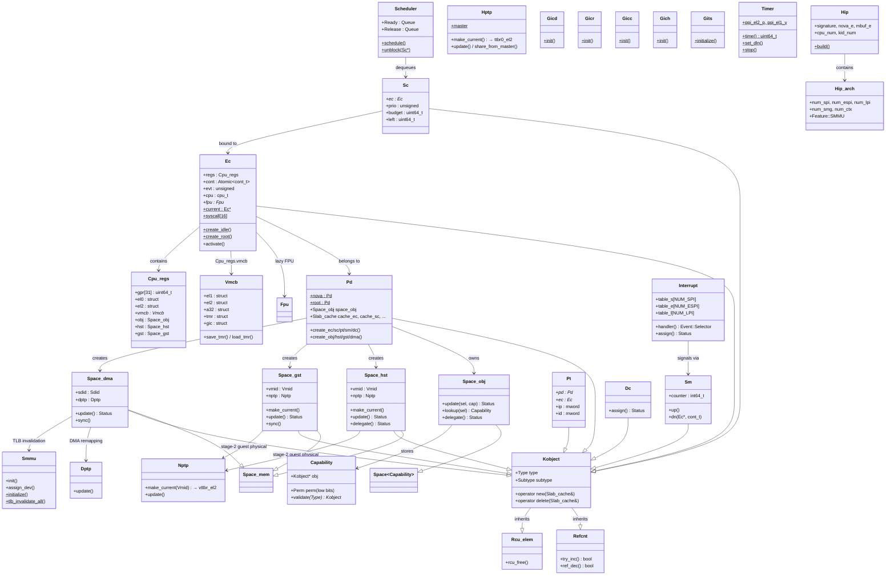

# NOVA Microhypervisor — AArch64 Boot Flow & Class Interactions

> **Scope**: This document describes the complete boot sequence for the NOVA microhypervisor on the AArch64 (ARM64) architecture, from the assembly entry point through to launching the root image. It also provides class-interaction diagrams covering the kernel object hierarchy and boot-time relationships.

---

## Table of Contents

1. [Boot Flow Overview](#1-boot-flow-overview)
2. [Assembly Entry (`start.S`)](#2-assembly-entry-starts)
3. [Early Initialisation (`init.cpp`)](#3-early-initialisation-initcpp)
4. [Per-CPU Bootstrap (`bootstrap.cpp`)](#4-per-cpu-bootstrap-bootstrapcpp)
5. [Root Image Launch (`ec.cpp`)](#5-root-image-launch-eccpp)
6. [Boot Flow Diagram](#6-boot-flow-diagram)
7. [Class Interaction Diagram](#7-class-interaction-diagram)

---

## 1. Boot Flow Overview

NOVA on AArch64 executes in **EL2** (Hypervisor Exception Level). The boot sequence follows this high-level path:

1. **`start.S`** — Assembly entry point: EL3→EL2 transition, page table setup, MMU enable, BSS/HEAP zero, call `preinit()` and `init()` (BSP only)
2. **`init.cpp`** — BSP early init: command line, buddy allocator, static constructors, console, ACPI/FDT platform discovery
3. **`bootstrap.cpp`** — Per-CPU init: CPU features, GIC, idle EC, GITs/SMMU (BSP), root PD creation (BSP), enter scheduler
4. **`ec.cpp`** — Root creation: build `Pd::root`, parse root ELF, create root EC+SC, build HIP, unblock root SC

---

## 2. Assembly Entry (`start.S`)

**File**: [../src/aarch64/start.S](../src/aarch64/start.S)

### BSP Entry (`__init_bsp`)

1. **Save boot parameters** — `X0` (DTB/MBI pointer), `X1`, `X2` stored to `__boot_p0/p1/p2`
2. **Parse Multiboot tags** — Scans Multiboot v2 → v1 → Legacy (FDT) for root image address
3. **UEFI initialisation** — If Multiboot v2 with EFI tag, calls `Uefi::init()`
4. **Cache maintenance** — Cleans D-cache, zeros `PTAB` region
5. **Build page tables** — Creates identity mapping and link-address mapping in `PT3S_HPAS`, using 1GiB/2MiB/4KiB block entries
6. **EL3→EL2 transition** — If current EL is EL3:
   - Configures `SCR_EL3` (HCE, SMD, NS, RW)
   - Configures `SPSR_EL3` (EL2h, D/A/I/F masked)
   - Issues `eret` to drop to EL2
7. **EL2 MMU configuration**:
   - `MAIR_EL2` — Memory attribute indirection register
   - `TCR_EL2` — Translation control (T0SZ for 48-bit VA, 4KiB granule, Inner-shareable WB-WA)
   - `TTBR0_EL2` — Points to `PT3S_HPAS`
   - `VBAR_EL2` — Points to `vector_table` (from `entry.S`)
   - `SCTLR_EL2` — Enables MMU (M), caches (C, I), stack alignment (SA), WXN
8. **BSS/HEAP zero** — Clears BSS and HEAP regions
9. **Boot lock** — Acquires `__boot_lock` (spin-lock for serialisation)
10. **Call `preinit()`** — Command-line parsing
11. **Call `init()`** — Returns `Cpu::boot_cpu` (BSP CPU number)

### AP Entry (`__init_psci` / `__init_spin`)

- Secondary CPUs enter via PSCI or spin-table, join the same EL2 configuration path
- Each CPU calls `kern_ptab_setup()` to map its per-CPU page tables
- All CPUs call `bootstrap(cpu)`

---

## 3. Early Initialisation (`init.cpp`)

**File**: [../src/aarch64/init.cpp](../src/aarch64/init.cpp)

### `preinit()`
- `Cmdline::init()` — Parses command line from Multiboot or FDT

### `init()`
1. `Buddy::init (MHIP, reinterpret_cast<mword>(&HASH))` — Initialises physical page allocator from the memory hole information page
2. **Static constructors** — Runs global constructors (CTORS_S → CTORS_E), including `Pd::nova` (INIT_PRIORITY: PRIO_SLAB)
3. **CPU-local constructors** — Runs CPU-local constructors (CTORS_C → CTORS_S)
4. `Console::print(...)` — Prints boot banner with version and architecture
5. `Acpi::init() || Fdt::init()` — Platform discovery (ACPI preferred, FDT fallback):
   - **ACPI path**: Parses MADT (CPUs, GIC), GTDT (timer), IORT (SMMU), SRAT, HEST, MCFG, etc.
   - **FDT path**: Walks device tree to discover CPUs, memory, interrupts, SMMU, UART
6. Returns `Cpu::boot_cpu` — The BSP CPU identifier

---

## 4. Per-CPU Bootstrap (`bootstrap.cpp`)

**File**: [../src/aarch64/bootstrap.cpp](../src/aarch64/bootstrap.cpp)

```
bootstrap(cpu):
  ├── Cpu::init(cpu)              // Per-CPU feature enumeration, GIC init
  │     ├── enumerate_features()  // Read ID registers, compute HCR/CPTR/MDCR
  │     ├── Gicd::init()          // GIC Distributor (BSP only on first CPU)
  │     ├── Gicr::init()          // GIC Redistributor
  │     ├── Gicc::init()          // GIC CPU Interface
  │     ├── Gich::init()          // GIC Hypervisor Interface
  │     ├── Timer::init()         // Configure EL2 physical timer
  │     ├── Nptp::init()          // Stage-2 page table init
  │     └── Vmcb::init()          // Virtual Machine Control Block init
  │
  ├── Ec::create_idle()           // Create idle EC for this CPU
  │
  ├── [BSP waits for all APs to arrive]
  │
  ├── Gits::initialize()          // GIC ITS init (BSP only)
  ├── Smmu::initialize()          // SMMU init (BSP only)
  │
  ├── [Global barrier — all CPUs synchronise]
  │
  ├── Ec::create_root()           // Create root PD + EC + SC (BSP only)
  │
  └── Scheduler::schedule()       // Enter scheduler — never returns
```

### `Cpu::init()` Detail

**File**: [../src/aarch64/cpu.cpp](../src/aarch64/cpu.cpp)

- `enumerate_features()` reads `ID_AA64*` system registers to determine:
  - Physical/virtual address sizes
  - GIC system registers support
  - SVE/SME availability
  - Hardware-managed dirty bits, etc.
- Computes `res0_hcr`, `res0_hcrx`, `res0_cptr`, `res0_mdcr` for proper EL2 configuration
- Initialises GIC components: `Gicd` → `Gicr` → `Gicc` → `Gich`
- `Timer::init()` — Configures `CNTHP_CVAL_EL2` (EL2 physical timer), reads `CNTFRQ_EL0`
- `Nptp::init()` — Sets up per-CPU nested page table root
- `Vmcb::init()` — Allocates per-CPU VMCB page

---

## 5. Root Image Launch (`ec.cpp`)

**File**: [../src/ec.cpp](../src/ec.cpp)

`Ec::create_root()` is called once on the BSP to create the entire root task:

### Step-by-step

1. **Create `Pd::root`** — calls `Pd::create()`, producing the root Protection Domain
2. **Create `Space_obj` for root** — object capability space for storing capabilities
3. **Create `Space_hst`** — host memory space (Nptp + Vmid for stage-2 translation)
4. **Create `Space_pio`** (x86 only, skipped on AArch64 — `needs_pio = false`)
5. **Delegate NOVA capabilities** — `Pd::nova.Space_obj::delegate(Pd::root.Space_obj, ...)` gives root access to Pd::nova's capabilities
6. **Create root Ec** — `Pd::root.create_ec(...)` with `Kobject::Subtype::EC_HST`, CPU = BSP, evt = 0
7. **Create root Sc** — `Pd::root.create_sc(...)` with priority 127 (maximum), budget = 1000ms
8. **Parse root ELF** — Validates ELF header (`Eh::valid(Machine::AARCH64)`), iterates program headers:
   - For each `PT_LOAD` segment: maps from root image into `Space_hst` via `hst->delegate()`
9. **`Integrity::measure()`** — Optional integrity measurement of the root image
10. **`Hip::build()`** — Constructs the Hypervisor Information Page:
    - Architecture-independent: signature, addresses, UEFI info, framebuffer, CPU/KID counts
    - Architecture-specific (`Hip_arch::build()`): SPI/ESPI/LPI counts, SMG/CTX counts, SMMU feature flag
11. **Map HIP** — Maps the HIP page read-only into root's host space
12. **Set root EC registers**:
    - `IP` = ELF entry point
    - `SP` = HIP virtual address
    - `X0/X1/X2` = boot parameters (`__boot_p0/p1/p2`)
13. **`Scheduler::unblock(sc)`** — Enqueues root SC into the scheduler; next `Scheduler::schedule()` will run it

---

## 6. Boot Flow Diagram

```mermaid
flowchart TD
    A["start.S: __init_bsp\n(EL3 or EL2)"] --> B["Save X0-X2 boot params"]
    B --> C["Parse Multiboot v2 / v1 / Legacy tags"]
    C --> D["UEFI::init() if EFI present"]
    D --> E["Clean D-cache, zero PTAB"]
    E --> F["Build identity + link-address page tables"]
    F --> G{"Current EL?"}
    G -- "EL3" --> H["Configure SCR_EL3\nSPSR_EL3, eret → EL2"]
    G -- "EL2" --> I["Configure EL2"]
    H --> I
    I --> J["MAIR / TCR / TTBR0 / VBAR / SCTLR\nEnable MMU + Caches"]
    J --> K["Zero BSS + HEAP"]
    K --> L["Acquire __boot_lock"]
    L --> M["preinit(): Cmdline::init()"]
    M --> N["init(): Buddy::init()"]
    N --> O["Static constructors\n(Pd::nova created)"]
    O --> P["Console banner"]
    P --> Q{"ACPI present?"}
    Q -- "Yes" --> R["Acpi::init()\nMMADT/GTDT/IORT/..."]
    Q -- "No" --> S["Fdt::init()\nDevice tree walk"]
    R --> T["Return boot_cpu"]
    S --> T
    T --> U["kern_ptab_setup()"]
    U --> V["bootstrap(cpu)"]

    V --> W["Cpu::init()\nFeatures, GIC, Timer"]
    W --> X["Ec::create_idle()"]
    X --> Y{"BSP?"}
    Y -- "Yes" --> Z["Wait for APs"]
    Z --> AA["Gits::initialize()"]
    AA --> AB["Smmu::initialize()"]
    Y -- "No" --> AC["Global barrier"]
    AB --> AC
    AC --> AD{"BSP?"}
    AD -- "Yes" --> AE["Ec::create_root()"]
    AD -- "No" --> AF["Scheduler::schedule()"]
    AE --> AF

    subgraph "Ec::create_root()"
        AE --> CR1["Pd::create() → Pd::root"]
        CR1 --> CR2["Create Space_obj + Space_hst"]
        CR2 --> CR3["Delegate Pd::nova caps"]
        CR3 --> CR4["Create root EC (HST, BSP)"]
        CR4 --> CR5["Create root SC (prio=127)"]
        CR5 --> CR6["Parse root ELF, map segments"]
        CR6 --> CR7["Hip::build()"]
        CR7 --> CR8["Map HIP read-only"]
        CR8 --> CR9["Set IP/SP/X0-X2"]
        CR9 --> CR10["Scheduler::unblock(sc)"]
    end
```



---

## 7. Class Interaction Diagram



---

## Key AArch64 Concepts

### Exception Levels
- NOVA runs at **EL2** — the hypervisor exception level
- User-mode (root task and VMs) run at **EL0** / **EL1**
- `start.S` handles EL3→EL2 drop if firmware boots at EL3

### Address Translation
| Page Table | Type | Controlled By | Purpose |
|---|---|---|---|
| **Hpt** / **Hptp** | Stage-1 | `TTBR0_EL2` | Kernel (EL2) VA → PA |
| **Npt** / **Nptp** | Stage-2 | `VTTBR_EL2` + VMID | Guest IPA → PA (host & guest spaces) |
| **Dpt** / **Dptp** | SMMU S2 | SMMU | Device DMA → PA |

### GIC Architecture (GICv3/v4)
| Component | Role | Init Location |
|---|---|---|
| **Gicd** | SPI distribution, routing | `Cpu::init()` (BSP, once) |
| **Gicr** | Per-PE redistributor (LPIs) | `Cpu::init()` (each CPU) |
| **Gicc** | CPU interface (ICC_* sysregs) | `Cpu::init()` (each CPU) |
| **Gich** | Virtual interface (ICH_* sysregs) | `Cpu::init()` (each CPU) |
| **Gits** | Interrupt Translation Service | `bootstrap()` (BSP, once) |

### Continuation-Passing Model
`Ec` uses a **continuation-passing** scheduler rather than call stacks:
- `cont_t = void (*)(Ec *)` — function pointer stored in `Ec::cont`
- Key continuations: `ret_user_hypercall`, `ret_user_exception`, `ret_user_vmexit`
- `make_current()` resets the stack pointer to `DSTK_TOP` and invokes the continuation directly

### VMCB (Virtual Machine Control Block)
Allocated per-CPU via `Buddy`, stores guest EL1 sysregs, EL2 control regs (HCR, HCRX), AArch32 state, virtual timer state, and virtual GIC list registers. Used for world-switch between hypervisor and guest.

---

*End of boot flow documentation.*
