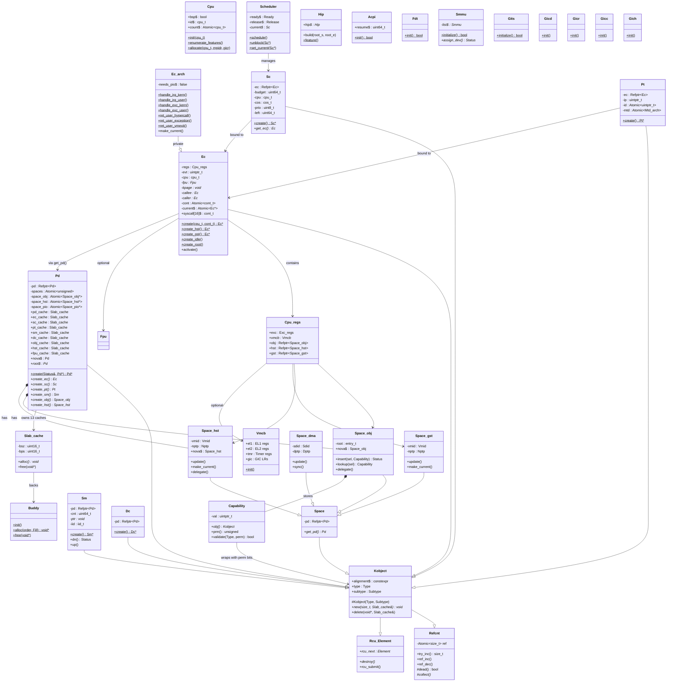
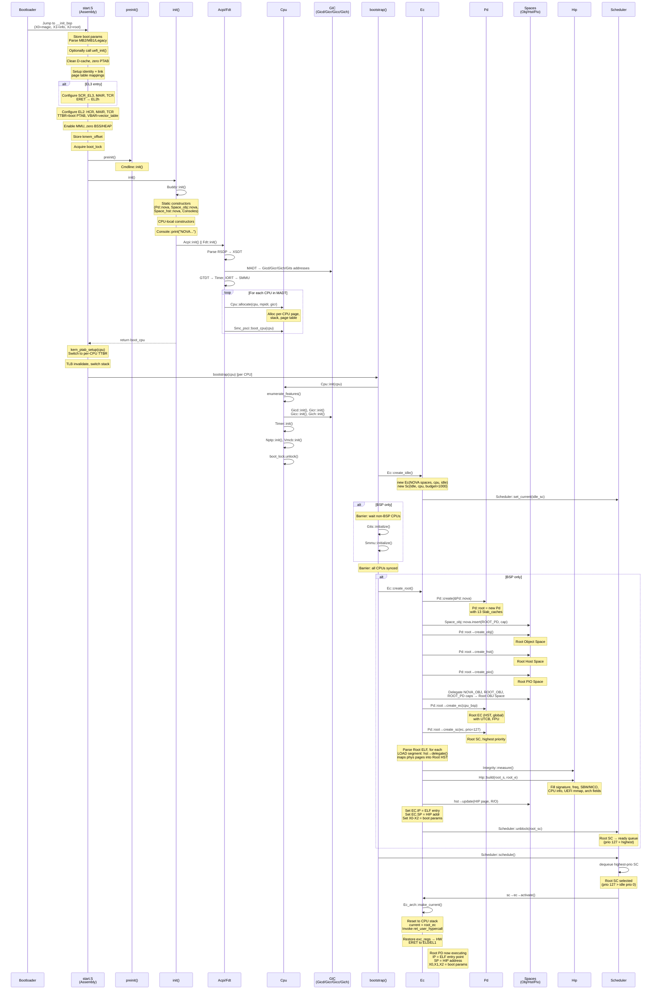

```mermaid
flowchart TD
    subgraph ASM["Assembly Boot (start.S)"]
        direction TB
        A0["__init_bsp Entry<br/>(EL2 or EL3)"]
        A1["Store boot params<br/>(X0, X1, X2)"]
        A2["Parse Multiboot v2/v1<br/>or Legacy launch"]
        A3["UEFI init<br/>(if applicable)"]
        A4["Clean/zero PTAB<br/>Setup boot page tables"]
        A5["EL3→EL2 switch<br/>(if started at EL3)"]
        A6["Configure EL2 MMU<br/>MAIR, TCR, TTBR, VBAR"]
        A7["Enable EL2 MMU<br/>Zero BSS/HEAP"]
        A8["Acquire boot_lock"]
        A9["preinit()"]
        A10["init()"]
        A11["Secondary CPUs:<br/>__init_psci / __init_spin"]
        A12["kern_ptab_setup()<br/>per-CPU page table"]
        A13["bootstrap(cpu)"]

        A0 --> A1 --> A2 --> A3 --> A4 --> A5 --> A6 --> A7 --> A8
        A8 -->|BSP| A9 --> A10 --> A12
        A8 -->|non-BSP| A12
        A11 --> A5
        A12 --> A13
    end

    subgraph PREINIT["preinit()"]
        P1["Cmdline::init()<br/>Parse command line"]
    end

    subgraph INIT["init() — BSP only"]
        direction TB
        I1["Buddy::init()<br/>Physical page allocator"]
        I2["CTORS_S → CTORS_E<br/>Static constructors"]
        I3["CTORS_C → CTORS_S<br/>CPU-local constructors"]
        I4["Console::print()<br/>Banner output"]
        I5["Acpi::init() || Fdt::init()<br/>Platform discovery"]

        I1 --> I2 --> I3 --> I4 --> I5
    end

    subgraph ACPI["Acpi::init() / Fdt::init()"]
        direction TB
        AC1["Parse RSDP → XSDT"]
        AC2["MADT → enumerate CPUs<br/>Gicd, Gicr, Gicc, Gich, Gits"]
        AC3["GTDT → Timer config"]
        AC4["IORT → SMMU enumeration"]
        AC5["SRAT, HEST, MCFG, etc."]
        AC6["Cpu::allocate() per CPU<br/>per-CPU data + page tables"]

        AC1 --> AC2 --> AC3 --> AC4 --> AC5 --> AC6
    end

    subgraph BOOT["bootstrap(cpu) — per CPU"]
        direction TB
        B1["Cpu::init(cpu)<br/>Feature enumeration"]
        B2["GIC init per-CPU<br/>Gicd, Gicr, Gicc, Gich"]
        B3["Timer::init()"]
        B4["Nptp::init(), Vmcb::init()"]
        B5["Ec::create_idle()<br/>Idle EC + SC per CPU"]
        B6["BSP: wait for all APs"]
        B7["BSP: Gits::initialize()"]
        B8["BSP: Smmu::initialize()"]
        B9["Barrier: all CPUs sync"]
        B10["BSP: Ec::create_root()"]
        B11["Scheduler::schedule()"]

        B1 --> B2 --> B3 --> B4 --> B5 --> B6 --> B7 --> B8 --> B9 --> B10 --> B11
    end

    subgraph ROOT["Ec::create_root() — BSP only"]
        direction TB
        R1["Pd::create(root)<br/>Root Protection Domain"]
        R2["create_obj, create_hst,<br/>create_pio → Root Spaces"]
        R3["Delegate NOVA Space caps<br/>into Root Object Space"]
        R4["Pd::root→create_ec()<br/>Root EC on CPU_BSP"]
        R5["Pd::root→create_sc()<br/>Root SC, highest priority"]
        R6["Parse Root ELF image<br/>Map segments into Root HST"]
        R7["Integrity::measure()"]
        R8["Hip::build()<br/>Build HIP, map read-only"]
        R9["Set EC regs: IP, SP<br/>Pass boot params X0-X2"]
        R10["Scheduler::unblock(sc)<br/>Root SC into ready queue"]

        R1 --> R2 --> R3 --> R4 --> R5 --> R6 --> R7 --> R8 --> R9 --> R10
    end

    subgraph SCHED["Scheduler::schedule()"]
        S1["Dequeue highest-prio SC"]
        S2["SC→EC→activate()"]
        S3["make_current()<br/>Enter userland"]
    end

    A9 -.-> PREINIT
    A10 -.-> INIT
    I5 -.-> ACPI
    A13 -.-> BOOT
    B10 -.-> ROOT
    B11 -.-> SCHED
```

```
Assembly Boot (start.S):
+---------------------+   +---------------------+   +---------------------+   +---------------------+   +---------------------+   +---------------------+   +---------------------+
| __init_bsp Entry    |   | Store boot params    |   | Parse Multiboot     |   | UEFI init           |   | Clean/zero PTAB     |   | EL3→EL2 switch      |   | Configure EL2 MMU   |
| (EL2 or EL3)        |   | (X0, X1, X2)        |   | v2/v1 or Legacy     |   | (if applicable)     |   | Setup boot page     |   | (if started at EL3) |   | MAIR, TCR, TTBR,    |
|                     |   |                     |   | launch              |   |                     |   | tables              |   |                     |   | VBAR                |
+---------------------+   +---------------------+   +---------------------+   +---------------------+   +---------------------+   +---------------------+
          |                     |                     |                     |                     |                     |
          v                     v                     v                     v                     v                     v
+---------------------+   +---------------------+   +---------------------+   +---------------------+   +---------------------+   +---------------------+
| Enable EL2 MMU      |   | Zero BSS/HEAP       |   | Acquire boot_lock   |   | preinit()           |   | kern_ptab_setup()   |   | bootstrap(cpu)      |
|                     |   |                     |   |                     |   |                     |   | per-CPU page tables |   |                     |
+---------------------+   +---------------------+   +---------------------+   +---------------------+   +---------------------+   +---------------------+
          |                     |                     |           |         |                     |                     |
          v                     v                     v           v         v                     v                     v
+---------------------+   +---------------------+   +---------------------+   +---------------------+   +---------------------+   +---------------------+
| BSP: __init_bsp     |   | non-BSP:            |   | Cmdline::init()    |   | init() — BSP only   |   | Buddy::init()       |   | CTORS_S → CTORS_E   |
| Entry               |   | __init_psci /       |   | Parse command line  |   |                     |   | Physical page       |   | Static constructors |
|                     |   | __init_spin         |   |                     |   |                     |   | allocator           |   |                     |
+---------------------+   +---------------------+   +---------------------+   +---------------------+   +---------------------+   +---------------------+
          |                     |                     |           |         |                     |                     |
          v                     v                     v           v         v                     v                     v
+---------------------+   +---------------------+   +---------------------+   +---------------------+   +---------------------+   +---------------------+
| CTORS_C → CTORS_S   |   | Console::print()    |   | Acpi::init() ||     |   | Parse RSDP → XSDT  |   | MADT → enumerate    |   | GTDT → Timer config |
| CPU-local           |   | Banner output       |   | Fdt::init()         |   |                     |   | CPUs                |   |                     |
| constructors        |   |                     |   | Platform discovery  |   +---------------------+   | Gicd, Gicr, Gicc,   |   +---------------------+
+---------------------+   +---------------------+   +---------------------+                         | Gich, Gits           |
          |                                     |                                           +---------------------+
          |                                     |                                                   |
          v                                     v                                                   v
+---------------------+   +---------------------+   +---------------------+   +---------------------+   +---------------------+
| IORT → SMMU         |   | SRAT, HEST,         |   | Cpu::allocate()     |   | bootstrap(cpu) —    |   | Cpu::init(cpu)      |
| enumeration         |   | MCFG, etc.          |   | per CPU             |   | per CPU             |   | Feature enumeration |
+---------------------+   +---------------------+   +---------------------+   +---------------------+   +---------------------+
          |                     |                     |           |         |                     |                     |
          v                     v                     v           v         v                     v                     v
+---------------------+   +---------------------+   +---------------------+   +---------------------+   +---------------------+
| GIC init per-CPU    |   | Timer::init()       |   | Nptp::init(),       |   | Ec::create_idle()   |   | BSP: wait for all   |
| Gicd, Gicr, Gicc,   |   |                     |   | Vmcb::init()        |   | Idle EC + SC per CPU|   | APs                 |
| Gich                |   +---------------------+   +---------------------+   +---------------------+   +---------------------+
+---------------------+                           |         |                     |                     |
          |                                           |         |                     |                     |
          v                                           v         v                     v                     v
+---------------------+   +---------------------+   +---------------------+   +---------------------+   +---------------------+
| BSP: Gits::initialize()| | BSP: Smmu::initialize()| | Barrier: all CPUs  |   | BSP: Ec::create_root()|
+---------------------+   +---------------------+   +---------------------+   +---------------------+
          |           |                     |         |                           |
          v           v                     v         v                           v
+---------------------+   +---------------------+   +---------------------+   +---------------------+
| Pd::create(root)    |   | create_obj, create_hst, | | Delegate NOVA Space |   | Pd::root→create_ec()|
| Root Protection     |   | create_pio → Root Spaces | | caps into Root Object|   | Root EC on CPU_BSP  |
| Domain              |   +---------------------+   | Space               |   +---------------------+
+---------------------+                           +---------------------+           |
          |                                     |                           |
          v                                     v                           v
+---------------------+   +---------------------+   +---------------------+
| Pd::root→create_sc()|   | Parse Root ELF image |   | Integrity::measure()|
| Root SC, highest     |   | Map segments into    |   |                     |
| priority             |   | Root HST             |   +---------------------+
+---------------------+   +---------------------+           |
          |                     |                               |
          v                     v                               v
+---------------------+   +---------------------+   +---------------------+
| Set EC regs: IP, SP |   | Scheduler::unblock(sc) | | Hip::build()        |
| Pass boot params X0-X2|   | Root SC into ready   |   | Build HIP, map      |
|                     |   | queue                |   | read-only           |
+---------------------+   +---------------------+   +---------------------+
          |                     |                               |
          v                     v                               v
+---------------------+   +---------------------+   +---------------------+
| SC→EC→activate()    |   | make_current()      |   | Enter userland      |
|                     |   |                     |   |                     |
+---------------------+   +---------------------+   +---------------------+
```

# Technical Analysis: ARM64 Kernel Boot & Root Domain Setup

This document provides a deep-dive into the transition from physical assembly initialization to a structured microkernel userland.

---

## I. EL2 MMU Bootstrap (The Memory Transition)

Before the kernel can execute high-level C++ code, it must transition the CPU from physical addressing to virtual addressing at **Exception Level 2 (EL2)**. This process ensures that memory protection and caching are active.


### 1. Architectural Configuration
The following hardware registers are configured during stages **A6** and **A7**:

* **MAIR_EL2 (Memory Attribute Indirection Register):** Defines the "flavors" of memory available.
    * *Attribute 0:* Device-nGnRnE (Strictly ordered, used for MMIO like UART/GIC).
    * *Attribute 1:* Normal Memory, Outer/Inner Write-Back Non-transient.
* **TCR_EL2 (Translation Control Register):** Sets the "rules" for the MMU:
    * **T0SZ:** Determines the size of the virtual address space (e.g., 48-bit).
    * **TG0:** Sets the page granularity (standard 4KB).
    * **ORGN0/IRGN0:** Sets cacheability for page table walks.
* **VBAR_EL2:** Points to the exception vector table so the kernel can catch synchronous aborts or interrupts immediately upon enabling the MMU.

### 2. The Identity Map (ID Map)
To prevent the CPU from crashing the moment the MMU is toggled, the kernel creates an **Identity Map** (Virtual Address == Physical Address) for the code currently executing. Once `SCTLR_EL2.M` is set to 1, the CPU continues fetching instructions from the same physical location via the new virtual mapping.

### 3. `kern_ptab_setup()`
Once stable, the identity map is replaced by the permanent kernel page tables. This maps the kernel into the "high-half" of the address space and establishes per-CPU stacks and data areas with strict permissions (NX for data, RO for code).

---

## II. Root Domain Instantiation (`Ec::create_root`)

In this microkernel architecture, the kernel does not manage hardware directly after boot. Instead, it creates a "Root Task" (Init) and delegates system authority to it.


### 1. Protection Domain (PD)
The **Root PD** is the primary security container. It consists of:
* **Object Space:** A table of capabilities (pointers) to kernel objects like Threads and IRQs.
* **Host Space:** The virtual memory layout (VMA) for the root process.

### 2. Capability Delegation
The kernel performs a "handover" of all system resources:
* All unallocated physical memory is converted into "Untyped" capabilities.
* All hardware IRQs and MMIO ranges are wrapped into capabilities.
* These are inserted into the Root PD's Object Space, making the Root Task the de-facto resource manager.

### 3. Execution Contexts (EC) and Scheduling Contexts (SC)
The kernel distinguishes between the *ability to run* and the *right to run*:
* **EC:** Contains the thread state (Registers, IP, SP).
* **SC:** Contains the scheduling parameters (Priority, Budget).
* The **Root SC** is assigned the highest priority in the system to ensure the system manager is never starved of CPU time.

### 4. The Handoff (Final Jump)
The kernel prepares the final jump to userland:
* **ELF Loading:** The Root ELF image is parsed; segments are mapped into the Root Host Space.
* **HIP (Hardware Info Page):** A read-only page containing the memory map and ACPI/FDT pointers is mapped for the userland task.
* **Registers:** `X0-X2` are loaded with boot parameters, and the `ELR_EL2` (Exception Link Register) is set to the ELF entry point.
* **`ERET`:** The kernel executes an Exception Return, dropping the CPU from EL2 to EL0 (Userland).

---

## III. Summary Table: Phase Responsibilities

| Phase | Responsibility | Mode |
| :--- | :--- | :--- |
| **ASM Boot** | Hardware prep, EL3->EL2, MMU Enable | Physical/Identity |
| **Kernel Init** | Global allocators, Platform discovery (ACPI/FDT) | Virtual (Kernel) |
| **Bootstrap** | Multi-core sync, Per-CPU GIC/Timer init | Virtual (Kernel) |
| **Root Setup** | Cap delegation, ELF loading, Root PD creation | Virtual (Kernel) |
| **Schedule** | Enter userland via `ERET` | Virtual (Userland) |

# Technical Analysis: Interrupt (GIC) and I/O Memory (SMMU) Orchestration

In an ARM64 system, managing how hardware talks to the CPU (Interrupts) and how hardware talks to Memory (DMA) is critical for system stability and virtualization.

---

## I. GIC Initialization (The Interrupt Pipeline)

The **Generic Interrupt Controller (GIC)**, specifically versions v3/v4, is responsible for routing hardware interrupts to the correct CPU cores.


### 1. Global Setup (GIC Distributor - GICD)
During `Acpi::init()`/`Fdt::init()`, the BSP (Bootstrap Processor) initializes the **Distributor**:
* **Enabling Affinity Routing:** Sets `GICD_CTLR.ARE_NS` to enable modern affinity-based routing (identifying CPUs by their `MPIDR_EL1`).
* **Group Configuration:** Categorizes interrupts into **Group 1 (Non-Secure)** so the kernel can handle them at EL2.
* **SPI Configuration:** Configures Shared Peripheral Interrupts (SPIs)—interrupts that can be handled by any CPU—based on the MADT (ACPI) or Device Tree.

### 2. Per-CPU Setup (GIC Redistributor - GICR)
In `B2. GIC init per-CPU`, every core must initialize its own private interface:
* **LPI Configuration:** Sets up the **ITS (Interrupt Translation Service)** tables in memory to support Message Signaled Interrupts (MSI/MSI-X) from PCIe devices.
* **Wakeup/Power:** Marks the Redistributor as "awake" so it can forward interrupts to the local CPU interface.
* **Priority Masking:** Sets `ICC_PMR_EL1` to allow interrupts above a certain priority threshold.

---

## II. SMMU Enumeration (The I/O Guard)

The **SMMU (System MMU)** is the hardware's version of the MMU. It ensures that a device (like a Network Card) can only perform DMA (Direct Memory Access) into memory regions specifically mapped for it.


### 1. Discovery and Probing
The kernel identifies SMMU instances via the **IORT (I/O Remapping Table)** in ACPI:
* **Stream ID Mapping:** The kernel builds a map of which hardware devices (identified by PCI BDF or Platform ID) correspond to which **Stream IDs** in the SMMU.
* **Register Mapping:** The SMMU's configuration registers are mapped into the kernel's virtual address space (Device memory).

### 2. Stage-1 vs Stage-2 Translation
The SMMU is configured to support two stages of translation:
* **Stage-1:** Controlled by the "guest" or userland (translating Virtual Address to Intermediate Physical Address).
* **Stage-2:** Controlled by the Hypervisor/Kernel (translating Intermediate Physical Address to actual Physical RAM). 
* During `B8. Smmu::initialize()`, the kernel sets up the **Context Banks** and **Steering Tables** that enforce these boundaries, preventing a rogue device from overwriting kernel memory.

---

## III. Summary: Data & Signal Flow

| Component | Responsibility | Primary Data Structure |
| :--- | :--- | :--- |
| **GICD** | Global interrupt routing | SPI Config Table |
| **GITS** | Translating PCIe MSIs to LPIs | Device & ITT Tables |
| **SMMU** | DMA protection/translation | Stream Table & STE |
| **GICR/C** | Local CPU interrupt delivery | LPI Pending/Config Tables |

```
+-------------------------------------+  +-------------------------------------+  +-------------------------------------+
| ASM BOOT (start.S)                  |  | INIT (init() - BSP only)            |  | BOOT (bootstrap(cpu) - per CPU)     |
+-------------------------------------+  +-------------------------------------+  +-------------------------------------+
| A0. __init_bsp Entry (EL2 or EL3)   |  | I1. Buddy::init() (Phys alloc)      |  | B1. Cpu::init(cpu) (Feature enum)   |
| A1. Store boot params (X0, X1, X2)  |  | I2. CTORS_S -> CTORS_E (Static)     |  | B2. GIC init per-CPU                |
| A2. Parse Multiboot v2/v1/Legacy    |  | I3. CTORS_C -> CTORS_S (CPU-local)  |  | B3. Timer::init()                   |
| A3. UEFI init (if applicable)       |  | I4. Console::print() (Banner)       |  | B4. Nptp::init(), Vmcb::init()      |
| A4. Clean PTAB / Setup page tables  |  | I5. Acpi::init() || Fdt::init()     |  | B5. Ec::create_idle()               |
| A5. EL3->EL2 switch <-----------+   |  +------------------|------------------+  | B6. BSP: wait for all APs           |
| A6. Config EL2 MMU (MAIR, TCR)  |   |                     v                     | B7. BSP: Gits::initialize()         |
| A7. Enable EL2 MMU / Zero BSS   |   |  +-------------------------------------+  | B8. BSP: Smmu::initialize()         |
| A8. Acquire boot_lock           |   |  | ACPI::init() / FDT::init()          |  | B9. Barrier: all CPUs sync          |
|  | (BSP)            | (non-BSP) |   |  +-------------------------------------+  | B10.BSP: Ec::create_root() -------+ |
| A9. preinit() ------|->[PREINIT]|   |  | AC1. Parse RSDP -> XSDT             |  | B11.Scheduler::schedule() ------+ | |
|  |                  |           |   |  | AC2. MADT -> CPUs / GIC enum.       |  +---------------------------------|-+-+
| A10. init() --------|->[INIT]   |   |  | AC3. GTDT -> Timer config           |                                    | |
|  |                  |           |   |  | AC4. IORT -> SMMU enumeration       |  +---------------------------------|-v-+
| A12. kern_ptab      |           |   |  | AC5. SRAT, HEST, MCFG, etc.         |  | ROOT (Ec::create_root BSP only) | |
|  |                  v           |   |  | AC6. Cpu::allocate() per CPU        |  +---------------------------------+ |
|  |                A12. kern_ptab|   |  +-------------------------------------+  | R1. Pd::create(root) (Root PD)    | |
|  +------------------+           |   |                                           | R2. create_obj/hst/pio -> Spaces  | |
| A13. bootstrap(cpu)             |   +--- A11. Sec CPUs: __init_psci/spin        | R3. Delegate caps to Root Space   | |
+--|------------------------------+                                               | R4. Root EC on CPU_BSP            | |
   |                                                                              | R5. Root SC (highest priority)    | |
   |  +-------------------------------+                                           | R6. Parse ELF/Map Root HST        | |
   +->| BOOT (All CPUs -> B1)         |                                           | R7. Integrity::measure()          | |
      +-------------------------------+                                           | R8. Hip::build(), map read-only   | |
                                                                                  | R9. Set EC regs (IP, SP, X0-X2)   | |
      +-------------------------------+                                           | R10. Scheduler::unblock(sc) ----+ | |
      | PREINIT: P1. Cmdline::init()  |                                           +---------------------------------|-+ |
      +-------------------------------+                                                                             |   |
                                                                                                                    |   |
+-------------------------------------------------------------------------------------------------------------------v---v-+
|                                    SCHEDULER (Scheduler::schedule() - All CPUs)                                         |
+-------------------------------------------------------------------------------------------------------------------------+
| S1. Dequeue highest-prio SC         ---->         S2. SC->EC->activate()         ---->         S3. make_current()       |
+-------------------------------------------------------------------------------------------------------------------------+
```



